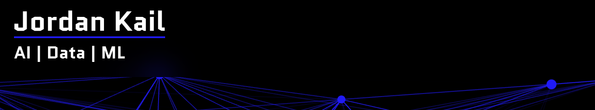
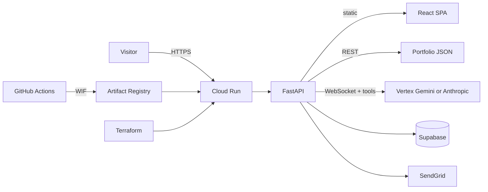

# Professional Portfolio 🚀

Welcome to my professional portfolio! Visit [jckail.com](https://www.jckail.com) to see it in action.

## Overview 🎯

This portfolio is a modern, full-stack web application showcasing my
professional experience through an interactive and engaging interface —
React + TypeScript on the frontend, FastAPI on the backend, and an AI
assistant on Vertex AI Gemini (Anthropic Claude is a supported alternative).

## Key Features ✨

### Interactive Resume Experience
- 📝 Dynamic professional timeline with detailed experiences
- 🛠️ Comprehensive skills showcase with proficiency levels
- 📊 Project portfolio with live demos and descriptions
- 📄 Downloadable ATS-friendly PDF resume, generated from the same data the site renders
- 🔎 Machine-readable surfaces from that data: crawler HTML snapshot, JSON-LD,
  `/llms.txt`, `/resume.json`, `/sitemap.xml`

### Smart Interactions
- 🤖 AI chat assistant (streamed over WebSocket) with conversation memory,
  page-aware context, portfolio search, and **site-navigation tools** (open
  sections/modals, download resume). It can also draft a message to Jordan,
  a meeting request or a phone-number request, but nothing is sent or
  revealed until the visitor reviews the card, enters their own email and
  confirms
- 🔗 Deep-linkable sections, modals, projects, and chat (`?ai_chat=open`,
  `?project=`, `?skill=`, `?company=`)
- ⌨️ Keyboard shortcuts: `?` opens chat; `g` then `a/e/p/s/r` jumps sections;
  `Ctrl/Cmd+K` command palette
- 🎨 Interactive doodle canvas (footer easter egg) + party mode (Konami /
  `?party=1`)
- 🍪 Cookie consent (denied by default, reopenable from the footer); analytics, including a first-party anonymous event stream, run only after opt-in
- 📱 Responsive design for all devices
- ♿ Fully keyboard-operable: focus-trapped dialogs, Escape-to-close
- 🌓 Light/dark mode — and a hidden party mode 🎉

### Professional Network
- 🔗 [LinkedIn](https://www.linkedin.com/in/jckail/)
- 💻 [GitHub](https://github.com/jckail)
- 📧 Direct contact form (SendGrid)

## Technology Stack 💻

### Frontend 🎨
- **React 18 + TypeScript** with **Vite 8** for fast dev and optimized builds
- **Zustand** for state management
- **MUI** + CSS custom properties for UI and theming
- **Vitest 4** for unit tests; **Playwright** for containerized E2E smoke tests

### Backend 🔧
- **FastAPI** on **Python 3.12** with **Pydantic v2**
- **Vertex AI Gemini** (or **Anthropic Claude**) for the streaming AI chat assistant, behind a provider interface
- **Supabase** for auth, telemetry, and log persistence
- **SendGrid** for contact email

### Infrastructure ☁️
- **Docker** multi-stage builds (Node 22 → Python 3.12 slim) with
  hash-pinned Python deps (`requirements.lock.txt`)
- **Google Cloud Run** behind **Artifact Registry**
- **Terraform** for infrastructure as code, including keyless GitHub → GCP
  auth via Workload Identity Federation (see [`infra/`](./infra/README.md))
- **GitHub Actions**: CI (lint, coverage-gated tests, Trivy image scan,
  Docker + Terraform checks) plus verify-before-promote deploys to Cloud Run
  on `main` (see [DEPLOYMENT.md](./DEPLOYMENT.md))
- **Cloud Logging** structured logs and events; Terraform for log-based metrics, alerts and a dashboard is written in `infra/` but not yet applied to production
- **Dependabot** for monthly grouped dependency updates

## Repository Layout 📂

```
portfolio/
├── frontend/          # React application (see frontend/README.md)
│   └── src/
│       ├── app/       # Feature components & providers
│       ├── shared/    # Stores, hooks, typed API client, shared components
│       └── styles/    # Global CSS
│
├── backend/           # FastAPI server (see backend/README.md)
│   ├── app/
│   │   ├── api/       # API routes (REST, chat WebSocket, discovery documents)
│   │   ├── services/  # Chat service, tools, and the llm/ provider layer
│   │   ├── config.py  # Centralized typed settings (all env access)
│   │   ├── models/    # Pydantic models + data loaders
│   │   ├── data/      # Portfolio content (JSON)
│   │   └── utils/     # Logging, Supabase client
│   ├── assets/        # Generated resume (PDF, text, manifest), party sprites
│   └── tests/         # Pytest suite (runs offline, no credentials needed)
│
├── e2e/               # Playwright smoke tests against the built image
├── docs/adr/          # Architecture decision records
├── infra/             # Terraform for GCP (Cloud Run, secrets, registry, WIF)
├── helpers/           # Dockerfiles, local dev tooling, e2e-in-Docker, resume generator
└── .github/workflows/ # CI + automatic Cloud Run deploys
```

## Getting Started 🚀

### Prerequisites
- Node.js 22+ and npm (matches the production frontend build image)
- Python 3.12+
- A `.env` file at the repo root (see [backend/README.md](./backend/README.md)
  for the full variable list)

### Development Setup

```bash
git clone https://github.com/jckail/portfolio.git
cd portfolio

pip install -r requirements-dev.txt   # prod deps + pytest, ruff
(cd frontend && npm install)

./helpers/local_test.sh
```

Then open:

- Frontend (hot reload): http://localhost:5173
- Backend API + built frontend: http://localhost:8080
- API documentation: http://localhost:8080/docs

### Browser tests

```bash
E2E_BASE_URL=http://localhost:8080 ./helpers/e2e-docker.sh   # Playwright in a container
```

### Deployment

Merges to `main` deploy automatically to Cloud Run via GitHub Actions once
the one-time setup in [DEPLOYMENT.md](./DEPLOYMENT.md) is complete. Do not
deploy from a laptop: `helpers/deploy.sh` is kept for reference only and is
unsafe (see [helpers/README.md](./helpers/README.md) and `HANDOFF.md`).

See [infra/README.md](./infra/README.md) for Terraform-managed infrastructure.

## Architecture 🏗️



Visitor traffic hits Cloud Run, which serves the Vite-built SPA and the
FastAPI API (including the streaming chat WebSocket). The model can request
validated UI actions that the SPA executes; actions that send mail or reveal
contact data only run after the visitor confirms them. Secrets live in Secret Manager;
deploys are keyless via Workload Identity Federation and only promote a
revision to 100% traffic after a health check against the new revision.

## Documentation 📚

- [Frontend documentation](./frontend/README.md)
- [Backend documentation](./backend/README.md)
- [Deployment checklist (secrets & CI/CD setup)](./DEPLOYMENT.md)
- [Deployment tooling](./helpers/README.md)
- [Infrastructure (Terraform)](./infra/README.md)
- [Architecture decisions](./docs/adr/README.md)
- [Improvement roadmap](./ROADMAP.md)
- API reference: `/docs` on a running backend

## Contributing 🤝

1. Follow the existing architecture patterns
2. Run the checks locally:
   - Frontend: `npm run lint && npm run type-check && npm test`
   - Backend: `python -m ruff check backend && python -m pytest backend/tests`
3. Write tests for new features
4. Update documentation
5. Submit pull requests for review
