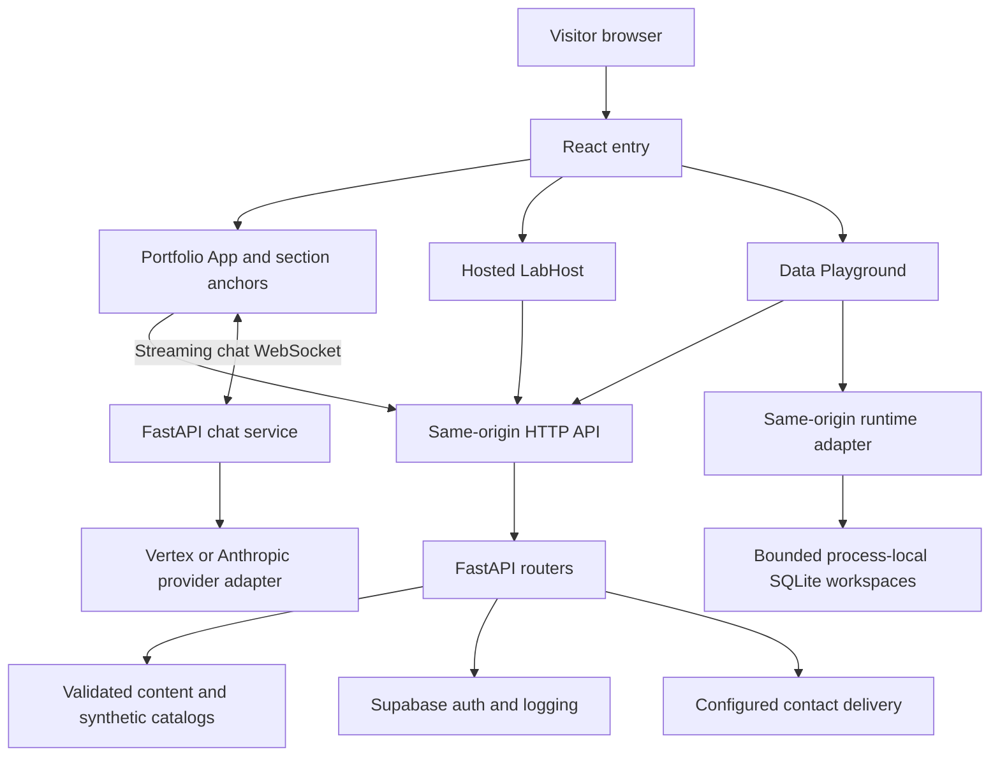
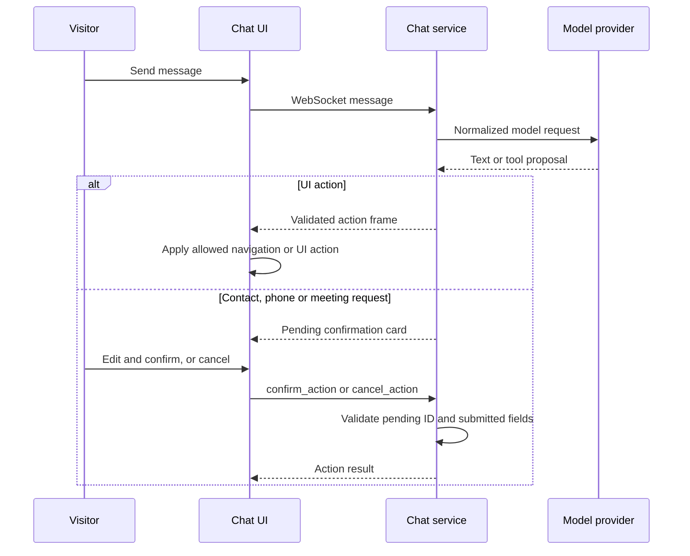
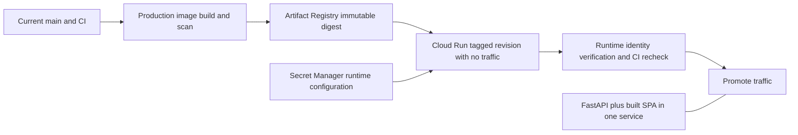

# Architecture

This guide follows source revision `184a0058e74acb788e03902d5bce173eeb081d54`. It describes the integrated entry points and their boundaries; a source review does not establish the deployed revision or provider availability.

## Request and UI flow

[main.tsx](../frontend/src/main.tsx) chooses `/dataplayground`, a recognized lab-shaped path, or the portfolio App. [lab-path.ts](../frontend/src/app/labs/lab-path.ts) excludes reserved paths, and [LabHost](../frontend/src/app/labs/lab-host.tsx) discovers `*/lab.tsx` modules lazily. A catalog entry without a matching interface gets a coming-soon view; unknown slugs get Not Found. Server-side [SPA routing](../backend/app/spa.py) and [API registration](../backend/app/api/__init__.py) determine HTTP status and forward behavior.

[MainContent](../frontend/src/app/components/main-content.tsx) eagerly renders About and lazily loads Experience, Projects, Skills, Resume, Doodle and admin components. `/admin` opens a dialog over the portfolio, not a separate dashboard. The portfolio [App](../frontend/src/app/app.tsx) wraps content in error boundaries, Data/Resume providers and the theme-dependent particle shell.

[DataProvider](../frontend/src/app/providers/data-provider.tsx) consumes server-inlined bootstrap content when present, otherwise fetches and caches content. [ResumeProvider](../frontend/src/app/providers/resume-provider.tsx) owns resume data. Zustand stores under `shared/stores/` own UI state such as theme, section and admin state. Reusable `shared/` and `types/` code must not import feature code from `app/`.

## Backend and integrations

[main.py](../backend/app/main.py) validates required environment names, initializes Supabase clients, warms content and mounts built frontend files when available. HTTP APIs mostly live under `/api`; discovery documents and configured lab forwards are explicitly registered at the site root. Chat is mounted under `/ws`.

The [shared API client](../frontend/src/shared/utils/api/client.ts) and [endpoint constants](../frontend/src/shared/utils/api/endpoints.ts) handle regular JSON requests. The chat hook uses a WebSocket; resume download has a separate blob path. Do not infer that every backend call uses one transport.

[Runtime settings](../backend/app/config.py) are cached and immutable after first access. Chat selects a provider through the [LLM interface](../backend/app/services/llm/base.py); [provider construction](../backend/app/services/llm/__init__.py) implements Vertex/Anthropic selection. Missing model credentials can leave chat unavailable while the site still boots. [ADR 0005](adr/0005-vertex-provider-service-account-bound-key.md) retains the provider and credential provenance.

## Visitor confirmation

[chat_service.py](../backend/app/services/chat_service.py) normalizes UI actions and stores pending execute-type requests per connection. [useChat](../frontend/src/app/components/chat/hooks/useChat.ts) displays pending cards and sends confirmation/cancellation frames. [chat-confirm.ts](../frontend/src/app/components/chat/chat-confirm.ts) validates editable fields and expiry; the server revalidates. This boundary applies to the named chat tools, not every HTTP endpoint. See [ADR 0006](adr/0006-execute-tools-need-visitor-confirmation.md) and [content provenance](adr/0007-content-truthfulness-guard.md).

## Labs and Data Playground

[Hosted labs](labs.md) are synthetic browser demos associated with project catalog entries; forwards belong to independently hosted apps. The portfolio does not deploy those apps' services.

[Data Playground](dataplayground.md) combines saved synthetic catalog results with a bounded visitor runtime. [dataplayground_runtime.py](../backend/app/services/dataplayground_runtime.py) uses process-local SQLite and bounded query results; it does not provide an external Kafka/dbt cluster or durable database. Optional custom simulations use a configured server adapter. The [Copilot adapter](../backend/app/services/dataplayground_copilot.py) has visitor-bound proposals and a confirmation path; its subprocess/provider configuration is separate from the home-page chat. Consult the existing feature guide before changing either integration.

## Cloud and release boundary

The [deploy workflow](../.github/workflows/deploy.yml) implements this sequence; [Dockerfile.prod](../helpers/Dockerfile.prod) packages the SPA and backend together. [Health routes](../backend/app/api/health_routes.py) distinguish liveness (`/api/health`, which can report degraded with HTTP 200) from readiness (`/api/health/ready`, which fails with HTTP 503 when the database is unavailable).

[Deployment](../DEPLOYMENT.md), [HANDOFF](../HANDOFF.md), [infrastructure](../infra/README.md) and the [ADR index](adr/README.md) remain the operational references. This document neither authorizes infrastructure changes nor replaces exact-revision CI, runtime, browser or deployment evidence.
