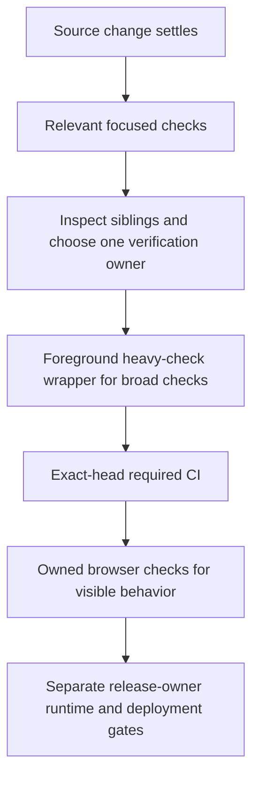

# Development and verification

Source basis: `184a0058e74acb788e03902d5bce173eeb081d54`. Read [AGENTS.md](../AGENTS.md) and [HANDOFF.md](../HANDOFF.md) before working in a shared checkout. This guide adds navigation and workflow context; it does not replace release-owner instructions.

## Environment and server ownership

CI uses Node.js 22 for the frontend, Python 3.12 for the backend and Node.js 24 for `copilot/`. The [frontend scripts](../frontend/package.json), [CI workflow](../.github/workflows/ci.yml) and hash-locked Python requirements are the version and command references.

The backend loads a local `.env` through [config.py](../backend/app/config.py). Required names at this revision are `SUPABASE_URL`, `SUPABASE_ANON_KEY`, `SUPABASE_SERVICE_ROLE`, `ALLOWED_ORIGINS`, `PORT`, `ADMIN_EMAIL` and `SENDGRID_API_KEY`. Keep actual values out of Git and logs. `ANTHROPIC_API_KEY` or `VERTEX_API_KEY` configures chat; neither is required for the whole site to boot. Optional lab/Copilot settings are documented in [Data Playground](dataplayground.md). Dummy values belong to mocked tests and do not establish a usable local service.

Before starting anything, inspect existing processes for this repository and sibling worktrees and check the intended ports. Reuse the existing owned server when appropriate. Otherwise, after confirming the ports are free and dependencies/configuration are ready, run these in separate terminals:

```bash
# Terminal 1: repository root
uvicorn backend.app.main:app --host 127.0.0.1 --port 8080 --reload --reload-dir backend

# Terminal 2: frontend/
npm run dev -- --host 127.0.0.1 --port 5173 --strictPort
```

[Vite](../frontend/vite.config.ts) proxies `/api` to port 8080 and `/ws` to the backend WebSocket. Record each server's PID, worktree, port and log. Stop only processes you own. Backend startup initializes configured services, so these commands are runtime operations, not offline checks.

Do not use [local_test.sh](../helpers/local_test.sh) as a routine server starter: it invokes [kill_hanging.sh](../helpers/kill_hanging.sh), which uses `kill -9` on port 5173/8080 processes and matching process names; it deletes `frontend/dist`, builds, then starts background servers. Those operations can disrupt another session and overwrite build artifacts.

## Choose checks by the change



From `frontend/`, available scripts are:

```bash
npm run lint
npm run type-check
npm test -- --maxWorkers=2
npm run test:coverage -- --maxWorkers=2
npm run build
```

Run only the checks relevant to the change during iteration. In the shared WSL workspace, dependency installs, production builds, broad suites and browser/E2E runs must use `/home/jkail/.local/bin/agent-heavy-check -- <command>` in the foreground after coordination. For example, from `frontend/` the owner runs `agent-heavy-check -- npm run build`. Exit 75 means contention; preserve the log and report it rather than queueing repeated attempts. Do not clear caches, delete build outputs or stop unrelated processes as a retry.

Backend CI uses the following existing commands from the repository root:

```bash
python -m ruff check backend
python -m compileall -q backend
python -m pytest backend/tests -q --cov --cov-report=term-missing
python3 -m unittest discover -s helpers -p test_verify_deployment.py -v
python3 -m unittest discover -s helpers -p test_cleanup_revision_tags.py -v
```

The [pytest configuration](../pyproject.toml) excludes `live` tests by default. Backend test fixtures supply mock configuration; do not remove those boundaries or substitute real provider credentials. Broad pytest belongs to the shared verification owner. Current shared-workspace qualification runs locally on GamingRig through the shared queue; the CI workflow is a source reference, not permission to trigger or retry GitHub Actions. Compileall checks Python compilation and may write bytecode; it is not a provider or startup check. CI also verifies Copilot, auth coverage, frontend boundaries/CSS tokens, Terraform validation, the production image and browser smoke/budget checks. Passing one focused command is not equivalent to passing that pipeline.

## Where to make changes

| Change | Start here | Retained guide |
| --- | --- | --- |
| Portfolio UI and lazy sections | `frontend/src/app/components/`, `app.tsx` | [Frontend](../frontend/README.md) |
| Content/bootstrap and API contracts | `backend/app/api/content.py`, models and data loaders | [Backend](../backend/README.md) |
| Chat transport, proposals and confirmation | `useChat.ts`, `chat_service.py`, `chat_tools.py` | [Confirmation ADR](adr/0006-execute-tools-need-visitor-confirmation.md) |
| Hosted lab or forward | Lab modules, catalog models and root routes | [Apps](apps.md), [labs](labs.md) |
| Synthetic data and visitor workspace | Data Playground feature/runtime adapters | [Data Playground](dataplayground.md), [operations](data-operations-design.md) |
| Deployment authorization or infrastructure | Existing workflow and verification helpers | [Deployment tooling](../helpers/README.md), [infra](../infra/README.md) |

Use [architecture](architecture.mdx) for the source map. Keep `shared/` and `types/` independent of `app/`, use declared CSS variables, preserve provider provenance and validate content through existing models. Do not hand-edit generated Data Playground metrics. Add new feature documentation alongside the existing guides and ADRs.

## Evidence and release

Keep separate records for source review, mocked/offline checks, rendered-browser behavior, configured provider/runtime checks and deployment. UI source may expose focus controls without proving complete keyboard behavior; mocked contact tests do not prove mail delivery. Check [open findings](audit-2026-09-06-open-findings.md) and the integration owner's current handoff before claiming a defect resolved.

Production uses [deploy.yml](../.github/workflows/deploy.yml): scan the built image, require current-main CI, deploy its immutable digest with no traffic, verify the tagged revision, recheck main/CI, promote and verify production identity. [DEPLOYMENT.md](../DEPLOYMENT.md) and [HANDOFF.md](../HANDOFF.md) retain setup and operational history; [helpers/deploy.sh](../helpers/deploy.sh) is not a supported release shortcut. No deployment or live-provider verification was performed to produce this guide.
