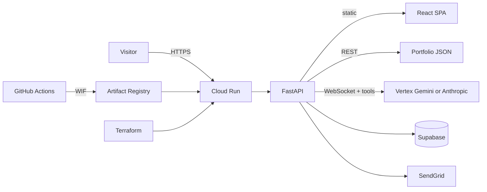

# Feature and stack overview

The longer feature list, technology stack and architecture narrative that used
to live in the root [README](../README.md). Source and tests are authoritative;
see [AGENTS.md](../AGENTS.md) ("What to trust") when this page and the code
disagree.

## Key features

### Interactive resume experience
- Dynamic professional timeline with detailed experiences
- Comprehensive skills showcase with proficiency levels
- Project portfolio with live demos and descriptions
- Downloadable ATS-friendly PDF resume, generated from the same data the site renders
- Machine-readable surfaces from that data: crawler HTML snapshot, JSON-LD,
  `/llms.txt`, `/resume.json`, `/sitemap.xml`

### Smart interactions
- AI chat assistant (streamed over WebSocket) with conversation memory,
  page-aware context, portfolio search, and **site-navigation tools** (open
  sections/modals, download resume). It can also draft a message to Jordan,
  a meeting request or a phone-number request, but nothing is sent or
  revealed until the visitor reviews the card, enters their own email and
  confirms. It runs in a right-side pane and on the dedicated `/agent` page;
  visitors get a two-message anonymous preview, then introduce themselves to
  continue (see [portfolio-assistant-runtime.md](./portfolio-assistant-runtime.md))
- Deep-linkable sections, modals, projects, and the chat pane (`?ai_chat=open`,
  `?project=`, `?skill=`, `?company=`)
- Keyboard shortcuts: `?` or `/` opens chat; `g` then `a/e/p/s/r` jumps sections;
  `Ctrl/Cmd+K` command palette
- Interactive doodle canvas (footer easter egg) + party mode. Party mode
  has several triggers: ten theme toggles within five seconds, the Konami
  code, `?party=1` or `#party`, the second footer doodle click, and the chat
  `set_theme` tool
- No visitor analytics: the earlier consent-gated analytics is retired and its helpers are inert, so there is no cookie banner and nothing is tracked (see [frontend/README.md](../frontend/README.md), "Navigation & Analytics")
- Responsive design for all devices
- Fully keyboard-operable: focus-trapped dialogs, Escape-to-close
- Light/dark mode — and a hidden party mode

### Hosted demos and forwards
- Some projects have an interactive, browser-only demo served by this site
  at `/<slug>` (synthetic data, server-rendered document for crawlers); others
  answer a `302` to their own domain. See [labs.md](./labs.md)

### Professional network
- [LinkedIn](https://www.linkedin.com/in/jckail/)
- [GitHub](https://github.com/jckail)
- Direct contact form (SendGrid)

## Technology stack

### Frontend
- **React 18 + TypeScript** with **Vite 8** for fast dev and optimized builds
- **Zustand** for state management
- **MUI** + CSS custom properties for UI and theming
- **Vitest 4** for unit tests; **Playwright** for containerized E2E smoke tests

### Backend
- **FastAPI** on **Python 3.12** with **Pydantic v2**
- **Vertex AI Gemini** (or **Anthropic Claude**) for the streaming AI chat assistant, behind a provider interface
- **Supabase** for auth, telemetry, and log persistence
- **SendGrid** for contact email

### Infrastructure
- **Docker** multi-stage builds (Node 22 frontend build and Node 24 copilot build → Python 3.12 slim) with
  hash-pinned Python deps (`requirements.lock.txt`)
- **Google Cloud Run** behind **Artifact Registry**
- **Terraform** for infrastructure as code, including keyless GitHub → GCP
  auth via Workload Identity Federation (see [`infra/`](../infra/README.md))
- **GitHub Actions**: CI (lint, coverage-gated tests, Trivy image scan,
  Docker + Terraform checks) plus verify-before-promote deploys to Cloud Run
  on `main` (see [DEPLOYMENT.md](../DEPLOYMENT.md))
- **Cloud Logging** structured logs and events; Terraform for log-based metrics, alerts and a dashboard is written in `infra/` but not yet applied to production
- **Dependabot** for monthly grouped dependency updates

## Repository layout (detailed)

```
portfolio/
├── frontend/          # React application (see frontend/README.md)
│   └── src/
│       ├── app/       # Feature components & providers
│       ├── shared/    # Stores, hooks, typed API client, shared components
│       └── styles/    # Global CSS
│
├── backend/           # FastAPI server (see backend/README.md)
│   ├── app/
│   │   ├── api/       # API routes (REST, chat WebSocket, discovery documents)
│   │   ├── services/  # Chat service, tools, and the llm/ provider layer
│   │   ├── config.py  # Centralized typed settings (all env access)
│   │   ├── models/    # Pydantic models + data loaders
│   │   ├── data/      # Portfolio content (JSON), including labs/ and forwards.json
│   │   └── utils/     # Logging, Supabase client
│   ├── assets/        # Generated resume (PDF, text, manifest), party sprites
│   └── tests/         # Pytest suite (runs offline, no credentials needed)
│
├── copilot/           # Node agent subprocess for the Data Playground copilot (see copilot/README.md)
├── e2e/               # Playwright smoke tests against the built image
├── docs/              # Index in docs/README.md: ADRs (adr/), runbooks, audits, design notes
├── infra/             # Terraform for GCP (Cloud Run, secrets, registry, WIF)
├── helpers/           # Dockerfiles, local dev tooling, e2e-in-Docker, resume generator
└── .github/workflows/ # CI + automatic Cloud Run deploys
```

## Architecture



Visitor traffic hits Cloud Run, which serves the Vite-built SPA and the
FastAPI API (including the streaming chat WebSocket). The model can request
validated UI actions that the SPA executes; actions that send mail or reveal
contact data only run after the visitor confirms them. Secrets live in Secret Manager;
deploys are keyless via Workload Identity Federation and only promote a
revision to 100% traffic after a health check against the new revision.
